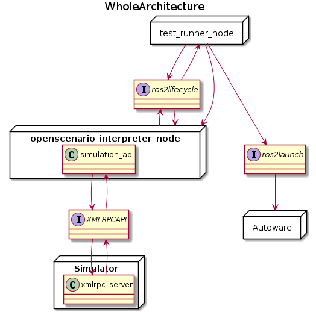

# System Architecture

This tool are consists of 3 components.
test runner, oepnscenario_interpretor, simulator.

Each component has these features.

1. test_runner  
test runner launch autoware and other components in this tools.  
test runner communicate with openscenario interpretor with ros2 lifecycle.  
(https://design.ros2.org/articles/node_lifecycle.html)

1. openscenario_interpretor  
test runner communicate with openscenario interpretor with rclcpp lifecycle.  
openscenario interpretor is a rclcpp lifecycle component.  

When the openscenario_interpretor launched, the state of openscenario_interpretor is "Unconfigured".  
When the test runner launched, ths test runner configures openscenario_interpretor and the state of the openscenario_interpretor becomes "Inactive".  
After the, the test runner activates openscenario_interpretor and move the state into "Active".
When the exception was thrown in openscenario interpretor, the openscenario interpretor moves into "Activate" state.

1. simulator  
simulator communicates with openscenario interpretor by using XMLRPC API.  
You can use any times of simulator by adapting this API.  