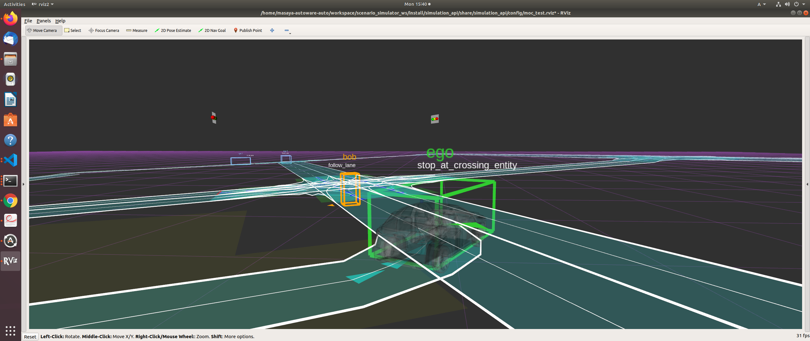

# ScenarioSimulator

Open scenario interpreter and simple simulator for Autoware



## Purpose of this package
Currently, various kinds of simulators and scenario formats are developed all over the world.  
We need open-source frameworkd for integrating those testing tools with Autoware easilly and quickly.  
So, we developed this package.    
<font color="Coral">__This package is designed to easily accommodate multiple simulators and scenario description formats.__</font>  
This package provides under Apache License Version 2.0.  
See also [LICENSE](LICENSE.md).

## How to use

### Run with ros2 launch 
```bash
ros2 launch scenario_test_runner scenario_test_runner.launch.py workflow:='$(find-pkg-share scenario_test_runner)/workflow_example.yaml' log_directory:='/tmp'
```

### Run with docker image
download docker image tar file form Google Drive. (https://drive.google.com/drive/folders/1Ep_CAytXa-wmIBz-_oh7hrV9UzOQTe9r?ths=true)
```bash
docker load -i scenario_simulator.tar
docker run -it -p 6080:80 --shm-size=512m scenario_simulator .
```

when you show such kinds of lines
```bash
* enable custom user: ubuntu
useradd: user 'ubuntu' already exists
  set default password to "ubuntu"
```

press ctrl+c once to start VNC server
then open http://localhost:6080/ in your browser.

launch lx terminal

```
ros2 launch scenario_test_runner scenario_test_runner.launch.py workflow:='$(find-pkg-share scenario_test_runner)/workflow_example.yaml' log_directory:='/tmp'
```

## Detailed Documentations
### How to use scenario editor
See [Scenario Editor](user_guide/scenario_editor/ScenarioEditorUserGuide.md)

### How to use scenario test runner
See [Scenario Test Runner](user_guide/test_runner/ScenarioTestRunner.md)

### Architecture documentation

See [Architecture Documentation](design/SystemArchitecture.md)

## Contact Infomation
See [Contact Infomation](etc/ContactUs.md)