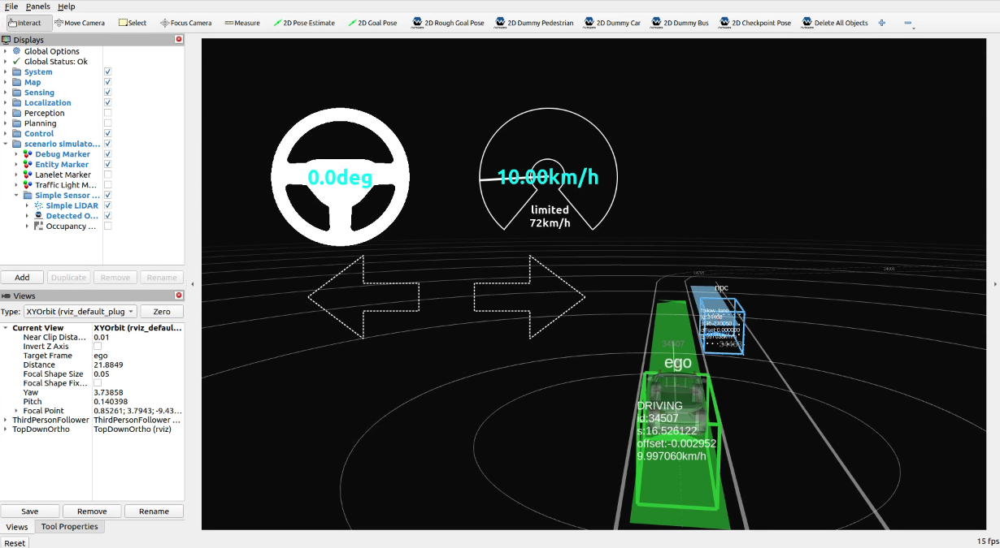

# Simple sensor simulator

The simple sensor simulator is a reference implementation of the simulator which follows our scenario testing framework.  
This package includes very simple sensor or detection result simulation.

Our simple sensor simulators do not include noise simulation, because scenario_simulator_v2 is a testing framework for planners or controllers instead of any perception modules. 

[//]: # (This package includes very, very simple lidar simulation and send simulated detection result to the Autoware.)

_Note! Simple Sensor Simulator is just a reference implementation, so we can adapt any kinds of autonomous driving simulators if we can develop ZeroMQ interface to your simulator._

## LiDAR Simulation
With this simulation, we can get lidar point-cloud data based on simple ray-casting algorithm.

### Interfaces

| interface                                   | type                                   | note                                                                                       |
|---------------------------------------------|----------------------------------------|--------------------------------------------------------------------------------------------|
| `traffic_simulator::API::attachLidarSensor` | C++ traffic simulator API interface    |                                                                                            |
| `attach_lidar_sensor`                       | ZeroMQ traffic simulator API interface | See [ZeroMQ Interfaces documentation](/docs/developer_guide/ZeroMQ.md) TCP Port : 5563 |  

### Configuration

See [the LidarConfigulation documentation](https://tier4.github.io/scenario_simulator_v2-docs/proto_doc/protobuf/#lidarconfiguration)

### Acknowledgments
In lidar simulation, we use intel's ray-casting library embree.

<iframe
class="hatenablogcard"
style="width:100%;height:155px;max-width:450px;"
title="embree"
src="https://hatenablog-parts.com/embed?url=https://github.com/embree/embree"
width="300" height="150" frameborder="0" scrolling="no">
</iframe>

## Occupancy Grid Sensor Simulation
With this simulation, we can get a cost map without processing lidar point cloud data.  
This enables us to reduce computational resources when we want to test Autoware's planners or controllers.  

### Interfaces

| interface                                           | type                                   | note                                                                                       |
|-----------------------------------------------------|----------------------------------------|--------------------------------------------------------------------------------------------|
| `traffic_simulator::API::attachOccupancyGridSensor` | C++ traffic simulator API interface    |                                                                                            |
| `attach_occupancy_grid_sensor`                      | ZeroMQ traffic simulator API interface | See [ZeroMQ Interfaces documentation](/docs/developer_guide/ZeroMQ.md) TCP Port : 5565 |  

### Occupancy Grid Values

| grid type      | value | description                                                         |
|----------------|-------|---------------------------------------------------------------------|
| occupied grid  | 100   | a grid determined by a simulated lidar sensor that an object exists |
| invisible grid | 50    | a grid that is out of range or occlusion of simulated lidar sensor  |
| empty grid     | 0     | an empty grid proved by a simulated ray-cast passing through        |    

### Configuration

See [the OccupancyGridSensorConfiguration documentation](https://tier4.github.io/scenario_simulator_v2-docs/proto_doc/protobuf/#occupancygridsensorconfiguration)

## Object Detection Results Simulation
With this simulation, you can get object detection results without processing images by heavy object detection algorithms.  
This also enables you to reduce computational resources when you want to test Autoware's planners or controllers.

### Interfaces

| interface                                       | type                                   | note                                                                                       |
|-------------------------------------------------|----------------------------------------|--------------------------------------------------------------------------------------------|
| `traffic_simulator::API::attachDetectionSensor` | C++ traffic simulator API interface    |                                                                                            |
| `attach_detection_sensor`                       | ZeroMQ traffic simulator API interface | See [ZeroMQ Interfaces documentation](/docs/developer_guide/ZeroMQ.md) TCP Port : 5564 |  

### Configuration

See [the DetectionSensorConfiguration documentation](https://tier4.github.io/scenario_simulator_v2-docs/proto_doc/protobuf/#detectionsensorconfiguration)
