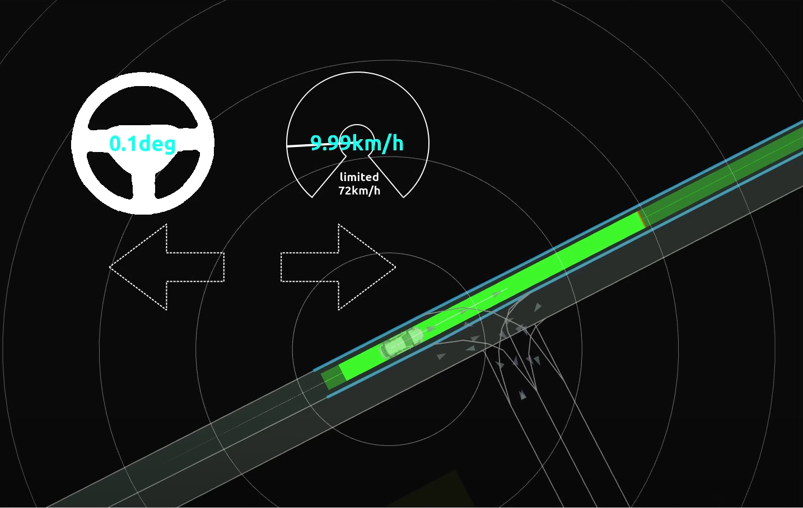

# Scenario simulator with Autoware Universe

This document contains step-by-step instruction on how to build and run [AWF Autoware Core/Universe](https://github.com/autowarefoundation/autoware) with `scenario_simulator_v2`.

## Prerequisites 

1. Ubuntu 20.04 machine
2. Hardware with CUDA 11.1 capable graphics card
3. ROS2 Galactic Geochelone desktop version [installed](https://docs.ros.org/en/galactic/Installation/Ubuntu-Install-Debians.html) and sourced:
   ```bash
   source /opt/ros/galactic/setup.bash
   ```

## How to build

1. Clone the Autoware Core/Universe repository:
   ```bash
   git clone git@github.com:autowarefoundation/autoware.git
   ```
2. Navigate to the source directory:
   ```bash
   cd autoware 
   mkdir src 
   ```
3. Import Autoware and Simulator dependencies:
   ```bash
   vcs import src < autoware.repos  
   vcs import src < simulator.repos
   ```
4. Install dependencies for Autoware Core/Universe
   > Note. This step is only required during first installation/usage of Autoware Core/Universe
   > 
   > Note: Before installing NVIDIA libraries, confirm and agree with the licenses.
   - [CUDA](https://docs.nvidia.com/cuda/eula/index.html)
   - [cuDNN](https://docs.nvidia.com/deeplearning/cudnn/sla/index.html)
   - [TensorRT](https://docs.nvidia.com/deeplearning/tensorrt/sla/index.html)

   ```bash
   ./setup-dev-env.sh
   ``` 
5. Install dependent ROS packages.

   ```bash
   source /opt/ros/galactic/setup.bash
   rosdep install --from-paths src --ignore-src --rosdistro $ROS_DISTRO
   ```
6. Build the workspace.

   ```bash
   colcon build --symlink-install --cmake-args -DCMAKE_BUILD_TYPE=Release
   ```

## How to run

1. Move to project directory, where the project is build.

2. Source the workspace setup script
   ```bash
   source install/setup.bash
   ```
3. Run scenario
   ```bash
   ros2 launch scenario_test_runner scenario_test_runner.launch.py \
   architecture_type:=awf/universe \
   record:=false \
   scenario:='$(find-pkg-share scenario_test_runner)/scenario/sample.yaml' \
   sensor_model:=sample_sensor_kit \
   vehicle_model:=sample_vehicle
   ``` 

### Expected behavior


