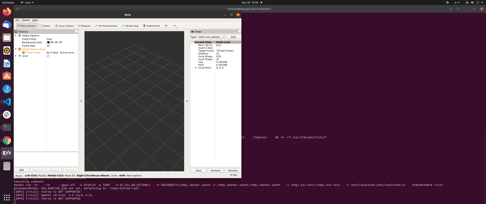

# Run with docker

## Install docker

Please follow instructions below.

<iframe
    src="https://hatenablog-parts.com/embed?url=https%3A%2F%2Fdocs.docker.com%2Fengine%2Finstall%2F" 
    title="Install Docker Engine" 
    class="embed-card embed-webcard"
    scrolling="no"
    frameborder="0"
    style="display: block; width: 100%; height: 155px; max-width: 500px; margin: 10px 0px;">
</iframe>

If you finished to install docker, please type commands below in order to check docker is working.
```bash
docker run hello-world
```

You can see output like below if you have succeed to install docker.  
```bash
Unable to find image 'hello-world:latest' locally
latest: Pulling from library/hello-world
b8dfde127a29: Pull complete 
Digest: sha256:f2266cbfc127c960fd30e76b7c792dc23b588c0db76233517e1891a4e357d519
Status: Downloaded newer image for hello-world:latest

Hello from Docker!
This message shows that your installation appears to be working correctly.

To generate this message, Docker took the following steps:
 1. The Docker client contacted the Docker daemon.
 2. The Docker daemon pulled the "hello-world" image from the Docker Hub.
    (amd64)
 3. The Docker daemon created a new container from that image which runs the
    executable that produces the output you are currently reading.
 4. The Docker daemon streamed that output to the Docker client, which sent it
    to your terminal.

To try something more ambitious, you can run an Ubuntu container with:
 $ docker run -it ubuntu bash

Share images, automate workflows, and more with a free Docker ID:
 https://hub.docker.com/

For more examples and ideas, visit:
 https://docs.docker.com/get-started/
```

## Install nvidia-docker2 (optional)

If you have nvidia GPU, in your machine, you have to install nvidia-driver and install nvidia-docker2

### Ubuntu

In order to install vidia-docker2 in ubuntu, please type commands below.

```bash
curl -s -L https://nvidia.github.io/nvidia-container-runtime/gpgkey | \
  sudo apt-key add -
distribution=$(. /etc/os-release;echo $ID$VERSION_ID)
curl -s -L https://nvidia.github.io/nvidia-container-runtime/$distribution/nvidia-container-runtime.list | \
  sudo tee /etc/apt/sources.list.d/nvidia-container-runtime.list
sudo apt-get update
```

If you finished to install docker and nvidia-docker2, please type this commands below.

```bash
docker run --gpus all --rm nvidia/cuda:9.0-base nvidia-smi
```

You can see outputs like below.

```bash
+-----------------------------------------------------------------------------+
| NVIDIA-SMI 460.56       Driver Version: 460.56       CUDA Version: 11.2     |
|-------------------------------+----------------------+----------------------+
| GPU  Name        Persistence-M| Bus-Id        Disp.A | Volatile Uncorr. ECC |
| Fan  Temp  Perf  Pwr:Usage/Cap|         Memory-Usage | GPU-Util  Compute M. |
|                               |                      |               MIG M. |
|===============================+======================+======================|
|   0  GeForce GTX 108...  Off  | 00000000:01:00.0  On |                  N/A |
| 23%   38C    P0    60W / 250W |    772MiB / 11175MiB |      0%      Default |
|                               |                      |                  N/A |
+-------------------------------+----------------------+----------------------+
                                                                               
+-----------------------------------------------------------------------------+
| Processes:                                                                  |
|  GPU   GI   CI        PID   Type   Process name                  GPU Memory |
|        ID   ID                                                   Usage      |
|=============================================================================|
+-----------------------------------------------------------------------------+
```

## Install rocker

<iframe 
  class="hatenablogcard" 
  style="width:100%;height:155px;max-width:450px;" 
  title="rocker" 
  src="https://hatenablog-parts.com/embed?url=https://github.com/osrf/rocker" 
  width="300" height="150" frameborder="0" scrolling="no">
</iframe>

rocker is a docker support tools for ROS.  
It enables us to run rviz inside docker very easilly.  
You can install rocker via pip3.
```bash
sudo pip3 install rocker
```

After install rocker, please check rocker works.  
If your machine has GPU, please type this commands below.  
```bash
rocker --nvidia --x11 osrf/ros:crystal-desktop rviz2
```
You can see rviz working on docker.  


If your machine has no GPU, please type this commands below.  
```bash
rocker --x11 osrf/ros:crystal-desktop rviz2
```
You can see same result with GPU.

## Build docker image locally (optional)

If you want to build docker image in your local machine, please type commands below in your terminal.

```bash
cd (path_to_scenario_simulator_v2)
docker build -t scenario_simulator_v2 .
```

## Runnig Simulation with docker.


