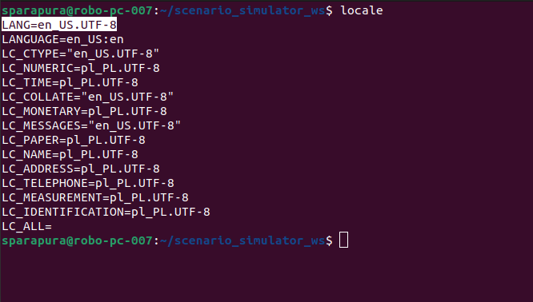

# Build Instructions

These setup instructions guide you through the process of building **Scenario Simulator v2**, which currently supports **ROS 2 Humble Hawksbill**.

## Setup ROS 2 environment

1. **Configure the locale**  
   Ensure that your system is configured with a locale that supports UTF-8.

   ```bash
   sudo apt update && sudo apt install locales
   sudo locale-gen en_US en_US.UTF-8
   sudo update-locale LC_ALL=en_US.UTF-8 LANG=en_US.UTF-8
   export LANG=en_US.UTF-8
   ```

   Verify that the locale is properly set:
   ```bash
   locale
   ```
     
   *The expected result after running the `locale` command should look like this, with **LANG** set to **en_US.UTF-8**.*

2. **Enable the Ubuntu Universe repository**  
   Run the following commands to enable the Universe repository:

   ```bash
   sudo apt install software-properties-common
   sudo add-apt-repository universe
   ```

     
   *The expected result after running `sudo add-apt-repository universe`.*

3. **Add the ROS 2 GPG key**  
   Install `curl` and add the ROS 2 GPG key to your system:

   ```bash
   sudo apt update && sudo apt install curl -y
   sudo curl -sSL https://raw.githubusercontent.com/ros/rosdistro/master/ros.key -o /usr/share/keyrings/ros-archive-keyring.gpg
   ```

4. **Add the ROS 2 repository to the system's package sources list**  
   This command adds the ROS 2 repository to the system’s package sources list, enabling access to ROS 2 packages:

   ```bash
   echo "deb [arch=$(dpkg --print-architecture) signed-by=/usr/share/keyrings/ros-archive-keyring.gpg] http://packages.ros.org/ros2/ubuntu $(. /etc/os-release && echo $UBUNTU_CODENAME) main" | sudo tee /etc/apt/sources.list.d/ros2.list > /dev/null
   ```

5. **Install ROS 2 Humble Desktop**  
   Update the apt cache and install ROS 2 Humble with the following command:

   ```bash
   sudo apt update
   sudo apt install ros-humble-desktop
   ```

6. **Install development tools**  
   Install the development tools needed to build ROS packages:

   ```bash
   sudo apt install ros-dev-tools
   ```
> **Reference:** [ROS 2 Humble Installation Guide](https://docs.ros.org/en/humble/Installation.html)

## Setup workspace

1. **Create the workspace directory**

   ```bash
   mkdir -p ~/scenario_simulator_ws/src
   cd ~/scenario_simulator_ws/src
   ```

2. **Clone the Scenario Simulator repository**

   ```bash
   git clone https://github.com/tier4/scenario_simulator_v2.git
   cd scenario_simulator_v2
   ```

3. **Import Autoware dependencies**

   ```bash
   vcs import external < dependency_humble.repos
   ```

## Install dependencies via rosdep

1. **Move to the workspace directory**  
   Before installing dependencies, navigate to the workspace directory where **Scenario Simulator v2** is located:

   ```bash
   cd ~/scenario_simulator_ws
   ```

2. **Source the ROS 2 environment**  
   Make sure the ROS 2 environment is properly sourced by running:

   ```bash
   source /opt/ros/humble/setup.bash
   ```

3. **Install all required dependencies**  
   Use `rosdep` to install all dependencies required for **Scenario Simulator v2**:

   ```bash
   rosdep install -iry --from-paths src/scenario_simulator_v2 --rosdistro humble
   ```

## Build scenario_simulator_v2
To build **Scenario Simulator v2**, run this command:
```bash
colcon build --symlink-install --cmake-args -DCMAKE_BUILD_TYPE=Release
```
  
*The expected result after running `colcon build` should display a message confirming a successful build.*