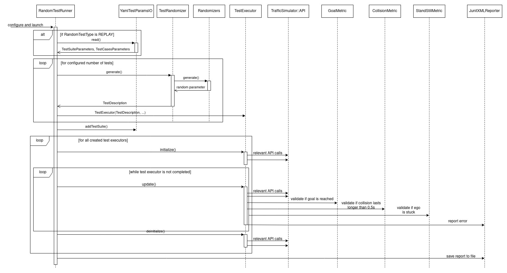

# Design

This section describes the details of `RandomTestRunner` implementation and behavior.

Before the simulation starts `RandomTestRunner` creates multiple `TestExecutors` for every test it needs to perform. In order to create `TestExecutor` it uses `TestRandomizer::generate` method which returns `TestDescription`. The description includes information about ego start and goal position as well as the information about npcs. This generated test description is passed to the `TestExecutor`. The generation process is done separately for each test executor.

In order to generate the test parameters `TestRandomizer` uses multiple `Randomizers`. It also uses `hdmap_utils::HdMapUtils` to operate on lanelets information.

During the test `TestExecutor` reports:
- collisions
- timeouts (when ego fails to reach target in a given time) 
- moments when ego is standing still (is stuck).

This information is reported to the object of `JunitXmlReporter` class.

After the test is finished random_test_runner calls `JUnitXMLReporter::write()`. Information reported during the test is saved to the `report.junit.xml` file inside configured directory. The directory can be specified as RandomTestRunner ROS2 parameter. To see the detailed description of the result file please see [Results](Usage.md#result-junit-file).

To better visualize how this module works please find the sequence diagram below:

